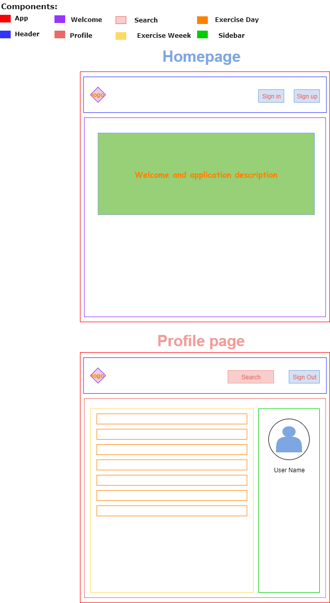
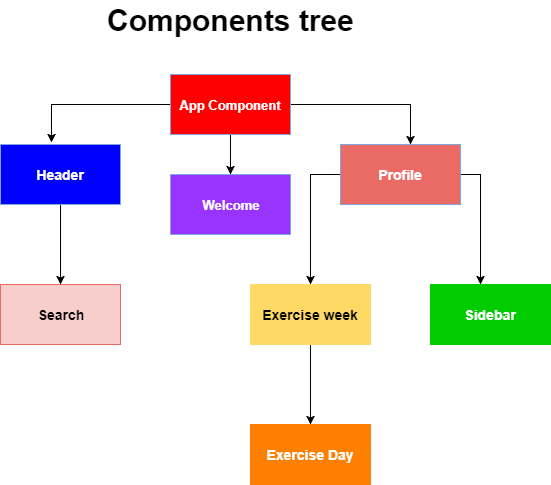

# Work On Yourself

Work On Yourself invites users to create an account and a list of their workout exercises based on the muscle group.

## Breaking UI Into Component Hierarchy


## Components Tree


## Setup

### Instructions:
In order for this project to work, first make sure you have **NodeJs** and git installed on your machine.

#### In the terminal
```
$ cd Desktop
$ git clone https://github.com/JohnSawiris/capstone-project-planning.git
$ cd capstone-project-planning
$ npm install
```
After ```npm install ``` finishes installation run this following command:
```
$ npm start
```

Open a browser tab and navigate to localhost:8080 and Sign up

## Improvements:

* Allow user to delete unwanted exercises from the list
* Allow user to add exercises fetched by the API to their list
* Allow the user to add profile image

## Technologies Used

* React.js
* Redux
* React-router-dom
* React-redux
* Redux-thunk
* Babel
* JSX
* CSS
* Webpack

### License
Copyright (c) 2018 **John Sawiris** All Rights Reserved.

_This software is liscensed under the MIT liscense
